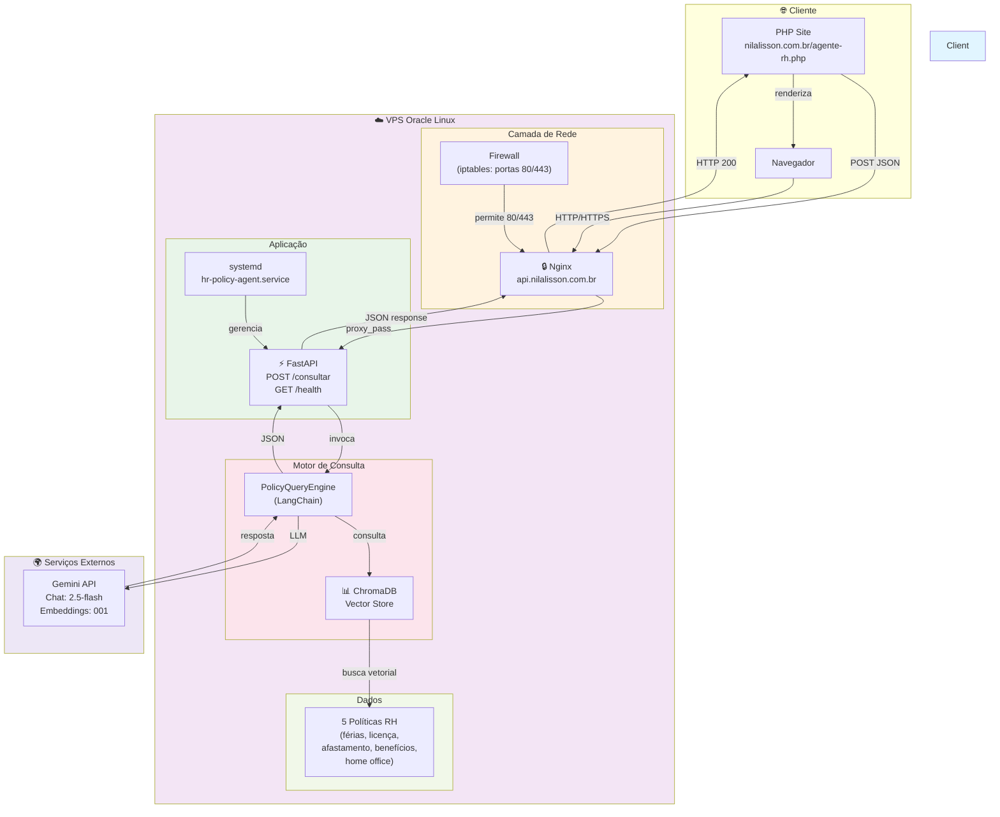

# HR Policy Agent (MCP)

Agente de IA que responde perguntas sobre políticas de RH (férias, licenças,
afastamentos, benefícios) e expõe suas capacidades via **Model Context
Protocol (MCP)**, permitindo que qualquer host compatível (Claude Desktop,
outro agente, uma plataforma de RH) o consuma como uma ferramenta padronizada
— em vez de uma API REST proprietária.

## Por que MCP, e não só uma API REST

Times de RH frequentemente operam com múltiplos sistemas e unidades de
negócio diferentes (folha, benefícios, LMS, recrutamento). Expor o agente via
MCP em vez de uma API ad-hoc significa que qualquer host MCP — incluindo
agentes de outras equipes — pode descobrir e usar as tools sem precisar de
um contrato de integração específico por sistema. O protocolo já resolve
discovery, schema e invocação.

## Arquitetura

```
## Arquitetura (com Mermaid)

Copie o diagrama abaixo no README.md (após a seção de Arquitetura):



Esse diagrama mostra:
- **Cliente** (seu site PHP)
- **Camada de rede** (firewall + nginx com HTTPS)
- **Aplicação** (FastAPI + systemd)
- **Motor** (QueryEngine + ChromaDB)
- **Dados** (corpus de políticas)
- **Integração externa** (Gemini API)
- **Fluxo completo** de request → response

---

### Como adicionar ao README:

No seu arquivo `README.md` local, procure a seção **"## Arquitetura"** (onde está o ASCII art antigo) e **substitua** por esse bloco Mermaid acima (entre os ```mermaid e ```).

Depois faz o commit: `"docs: adicionar diagrama Mermaid da arquitetura"`

GitHub vai renderizar automaticamente quando você abrir o README no navegador.P
```

O `query_engine.py` foi deliberadamente separado do `mcp_server.py`: isso
permite testar e avaliar o RAG (retrieval, qualidade de resposta) de forma
independente do protocolo de exposição.

## Tools expostas via MCP

| Tool | Descrição |
|---|---|
| `consultar_politica(tema)` | Responde uma pergunta sobre um tema de política de RH, citando o ID da política usada como fonte |
| `verificar_elegibilidade(funcionario_contexto, beneficio)` | Verifica se um perfil de colaborador é elegível a um benefício específico |
| `resumir_mudancas(periodo_descricao)` | Resume políticas vigentes e suas versões, simulando um changelog institucional |

## Rastreabilidade

Cada política do corpus carrega metadados de `policy_id`, `versao` e
`vigencia`. Toda resposta do agente cita o(s) `policy_id` usado(s) como
fonte — mesmo princípio de rastreabilidade requisito → evidência aplicado
em auditorias de ambientes regulados.

## Como rodar

```bash
pip install -r requirements.txt
export GOOGLE_API_KEY="sua-chave-aqui"

# 1. Gerar o índice vetorial
python src/ingest.py

# 2. Testar o RAG isoladamente (sem MCP)
python tests/test_query_engine_manual.py

# 3. Subir o servidor MCP
python src/mcp_server.py
```

Para consumir via um host MCP (ex: Claude Desktop), adicione ao arquivo de
configuração do host:

```json
{
  "mcpServers": {
    "hr-policy-agent": {
      "command": "python",
      "args": ["/caminho/absoluto/para/src/mcp_server.py"],
      "env": { "GOOGLE_API_KEY": "sua-chave-aqui" }
    }
  }
}
```

## Escopo e limitações

- Corpus 100% sintético, criado para fins de portfólio — não reflete
  política real de nenhuma empresa.
- Embeddings e geração usam a API do Google Gemini (free tier).
- Projeto de estudo aplicado, focado em demonstrar: (a) desenho de RAG com
  rastreabilidade de fonte, e (b) exposição de agente via protocolo MCP.
  Não inclui autenticação, multiusuário ou infraestrutura de produção.

## Próximos passos (roadmap)

- [ ] Avaliação com RAGAS (faithfulness, context precision) sobre um
      conjunto de perguntas de referência
- [ ] Pipeline de CI (GitHub Actions) rodando os testes de RAG a cada push
- [ ] Expandir corpus com mais políticas e casos de borda (ex: acúmulo de
      benefícios, mudança de regime CLT → PJ)
